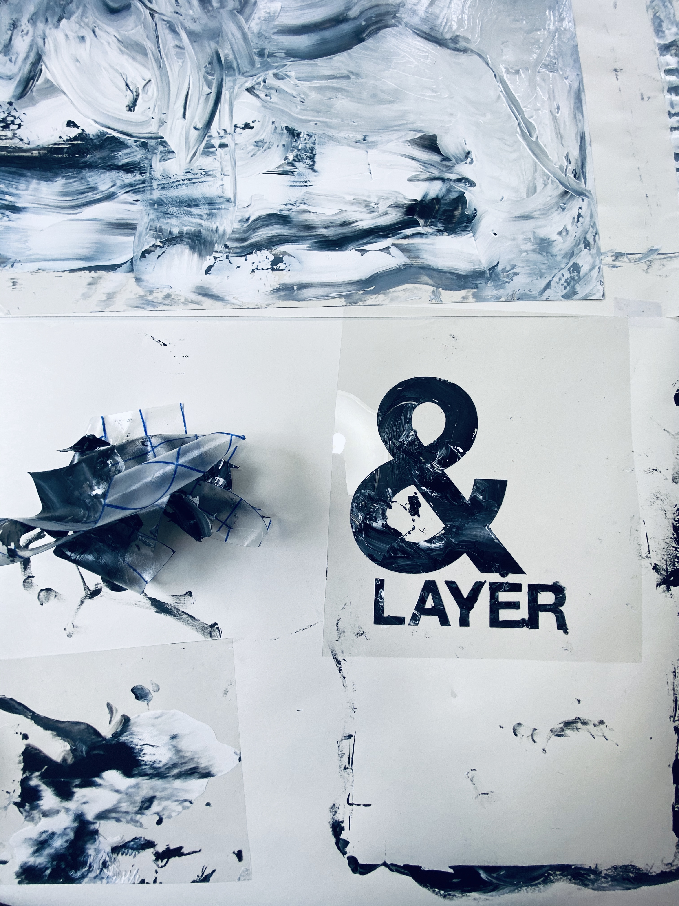

An integral part to becoming an artist means attempting to give shape to your creative output. As someone brand new to a full-time artistic effort, I am finding that having the time and resources to make anything means it's so easy to jump from one thing to another and actually achieve nothing.

I want nothing more than to get started and run with this exciting new effort but somehow feel blocked. Ideas are just too big, too fuzzy and it's hard to see where to start.

Then I started to look at materials around me.

I stumbled upon a piece of Mylar with paint smeared across it I produced as part of a client branding project years ago. I remembered the excitement I felt when doing this, even for a client, and it immediately sparked my curiosity, and an urge to try it again. With my head loaded with that idea, synapses started to connect and ideas began to spark of things I could do using that technique, even using that original piece of Mylar.

It was then it hit me: **constraints are freeing.**

By looking at that piece of painted Mylar and asking what I could do with it, I had naturally constrained my thinking to what could be done with THAT, just THAT.

This made me think about other times I've felt a surge of ideas like that.

I often recount to other makers that getting myself a cheap 3D printer made my head explode with ideas. I thought of so many things to print and immediately started producing with it.

Why was that a productive time?

Well, my take is that the 3D printer, although a very versatile machine, actually introduced some constraints into what was possible as a creative output. Objects you design for a 3D printer have to be designed in a certain way in order to print correctly, and because you have to buy individual materials, I decided to limit myself just to printing in a black, carbon fiber material that I really like the look of.

This unlocked a lot of the potential within my grasp.

So as a note to self, and anyone else that stumbles upon my journaling: when starting a new, creative project be sure to introduce a set of constraints in which to work. Ideally, to make meaningful work, you should define what you want to say with it and have an idea of how you want viewers to feel in response to it, but starting with constraints can provide the basic platform you need to build on the idea.

These could be aesthetic/medium constraints eg. only use white paper, time based constraints eg. must be completed in a day, based on your viewers eg. must be accessible to visually impaired people or some other context, eg. must live outside within a forest and be able to withstand weather.
This also provides a frame in which to the eventually evaluate the success of your output, leading to learnings and motivation to keep doing the work.

Any other tips for developing new artistic ideas? Please leave comments below!
