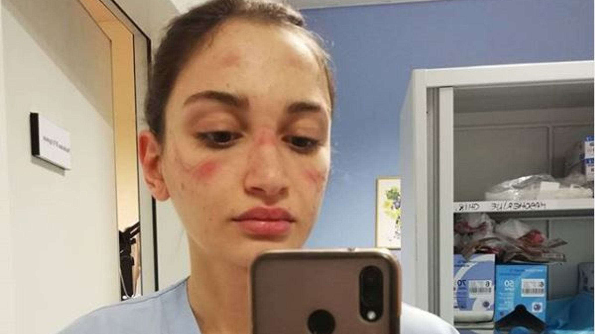
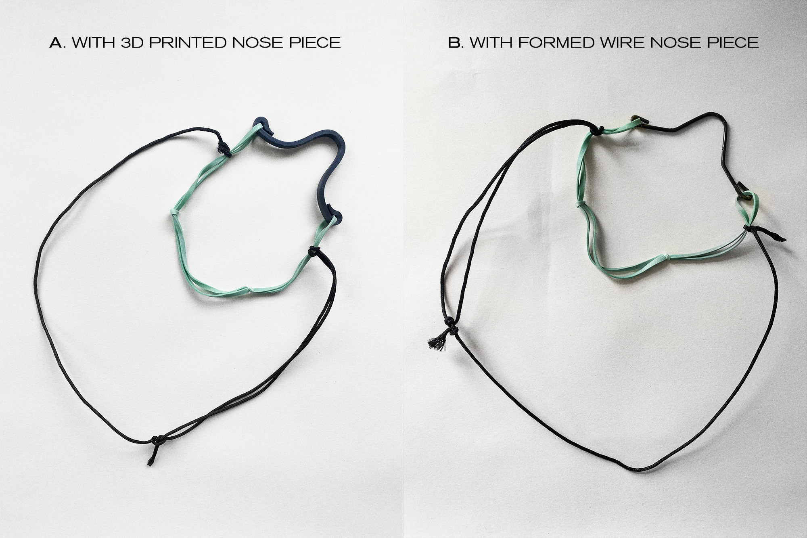
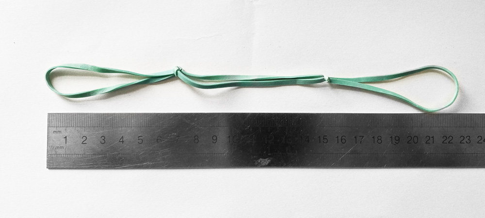
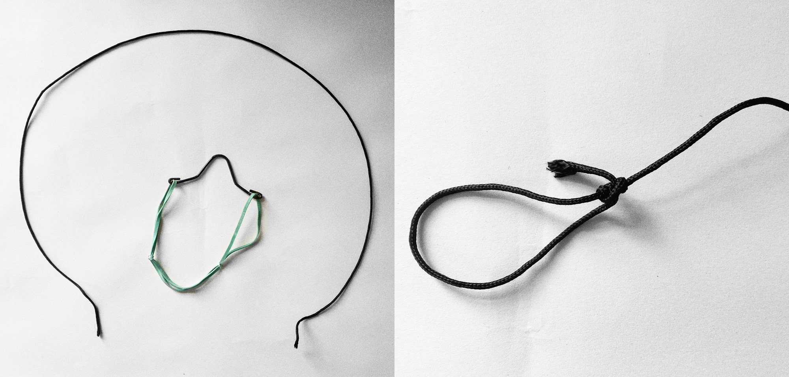
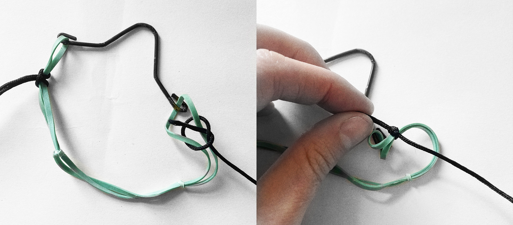
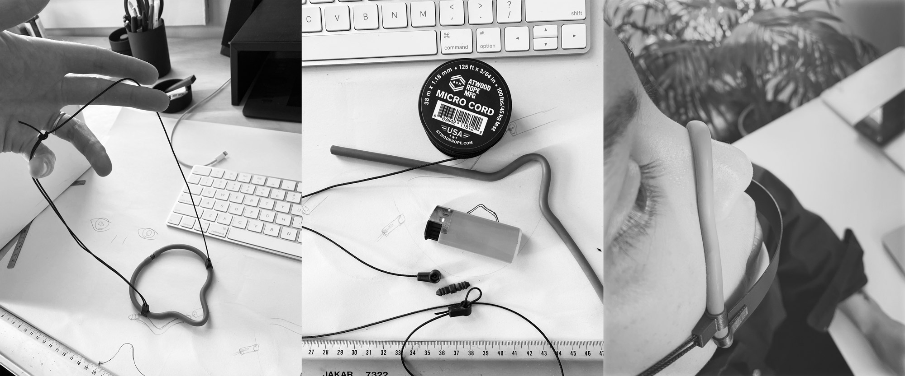

<h2 style="text-align: center; margin: 0 0 4rem;">A DIY face mask designed with as little as possible, for as many people as possible.</h2><!-- end -->

<iframe src="https://giphy.com/embed/kBqiLu8DGZGecCBuME" width="100%" height="100%" style="position:absolute;" frameBorder="0" class="giphy-embed"></iframe>

## The Context

It's 2020, a global pandemic of COVID-19 is under way. This virus can spread through airborne droplets expelled by anyone infected.
Governments around the world have recommended wearing facemasks in an attempt to catch airborne viruses before they reach a persons airways.

## The Problems

### Increased Chances of Infection
If handled incorrectly, facemasks can actually increase a wearer's chances of infection. As one is worn, particles are drawn from the air by the breath towards the mouth getting caught by the mask. By handling the mask, say by dropping it down to eat and then sliding it back up all those particles come into contact with fingers or get smeared on the face.

A recommendation is to treat a mask like a worn piece of underwear once removed. Wash it right away or if it's disposable, discard. This creates a problem where if only one mask is owned then it’s unavailable until washed.

### Discomfort
If we are in this for the longhaul then prolonged wearing of masks may become a daily reality. Medical professionals and regular people alike don't even need to complain that the current masks on the market and DIY creations exert a <a href="https://news.sky.com/story/coronavirus-bruised-by-face-masks-nurses-show-the-impact-of-fighting-the-pandemic-11955457" target="_blank">lot of pressure</a> on the ears, bridge of nose and face - the pictures speak for themselves. For the public, without the intensity immediate threat seen in hospitals, an uncomfortable mask will soon become an unworn mask.

### Performance
A common issue with masks is that they can leak with areas such as the bridge of the nose to the cheek and under the chin often cited as places of entry of particles during tests.

### Shortage
And then we have a <a href="https://www.usnews.com/news/best-countries/articles/2020-03-18/the-global-effort-to-tackle-the-coronavirus-face-mask-shortage" target="_blank">global mask shortage</a>.

## The Solution

__EVERYMASK__ is a DIY mask that uses a custom harness to tightly fit a sheet of filter material to a person's face. It's built with the idea that SOMETHING is better than nothing.
It uses an adjustable headstrap to avoid ear fatigue and a custom-formed nose piece spreads tension across more of the nose and cheeks vs creating sores on the bridge. By using an elastic loop around the face and pulling it in using the head strap a better seal is created.

After use the filter material can be easily disposed of or washed without the wearer having to touch the potentially contaminated filter material, and because the wearer only replaces the filter portion they don't have to reset the comfort of the harness.

By focusing on the harness I hope that a community of __EVERYMASK__ users can improvise on the filter's material and pattern and prevent more infections. Resources are limited at the moment, so this mask has been designed with <a href="https://www.nasa.gov/isru" target="_blank">NASA's ISRU principles</a> in mind meaning that it can be made with commonplace household materials and a pair of pliers.

## Instructions

### Materials
There are two possible versions of the harness.

- 1 uses a 3D printed nose piece, files are available on <a href="https://www.thingiverse.com/thing:4266151" target="_blank">Thingiverse</a> to print either a small or large version of these nose pieces. They were designed around my wife's and my own nose so there's a good chance the fit wont be perfect unless you can tweak your own 3D files. If you have access to a 3D printer go ahead and print this.
- 2 uses a nose piece formed from a piece of stiff wire. Grab yourself a wire clothes hanger, a pliers and the printable template <a href="https://drive.google.com/file/d/1A2XI8fvE4TTh6kAMSWZiRk6TE4P8aZZH/view?usp=sharing" target="_blank">available here</a>.

To complete both versions you will also need:
- A few rubber bands
- 80 cm (~32 inches) of string - ideally thin, nylon cord like kite string or sash cord.

### Build

#### 1. Nose Piece (Wire)

__1.1__ Using <a href="https://drive.google.com/file/d/1A2XI8fvE4TTh6kAMSWZiRk6TE4P8aZZH/view?usp=sharing" target="_blank">the template</a> as a starting guide, snip the appropriate sized piece of stiff wire from the hanger. Note: due to the challenges of isolation the template was designed around my wife's and my own nose so be prepared to tweak the result to fit yours.

__1.2__ Starting from the ends, use a short nose pliers to bend the hooks that will hold the elastic. Leave a gap so that we can slide the elastic into the hook (see step 2.2) later on.

__1.3__ Finish the nose piece by forming the curve that will fit over the bridge of your nose. This is the trickiest part of the process, don't worry if it's not perfect.

#### 2. Elastic
__2.1__ Chain enough rubber bands together to make around a 22-26 cm (9-9.8 inches) length. This part controls the fit to the face, you want that to be tight enough that it creates a good seal, but loose enough to be comfortable. You may need to jump back to this step after testing the fit. 

If you're not sure how to chain rubber bands see <a href="http://littletinkerer.blogspot.com/2014/10/make-your-own-rubber-band-car.html" target="_blank">step 4 here</a>.

__2.2__ Slip both ends of the rubber band chain into the nose piece hooks and squeeze the hooks shut using the pliers.

__2.3__ That's step 2 finished! You can try it on and it might hook on the bridge of your nose - don't worry if it doesn't fit great at this point, it probably won't. Next we're going to add the headstrap which will pull the band towards your cheekbones and create a 'seal' strong enough to tightly hold out filter fabric.

#### 3. Headstrap

__3.1__ Cut about 80 cm (~32 inches) of string/cord and tie a <a href="https://www.animatedknots.com/midshipmans-hitch-knot" target="_blank">Midshipman's Hitch Knot</a> in one end. This knot allows us to create a sliding, adjustable loop that holds when under tension - useful and easy to learn!

__3.2__ In the same way you chained the rubber bands together, fasten the loop to the rubber bands around 2.5 cm (1 inch) from the nose piece hook.

__3.3__ Tie two regular overhand knots one after the other to connect the other end to the rubber band to complete the harness.

__3.4__ Your harness is complete! Put the nose piece on, pull the rubber band down under your chin and lift the headstrap over your head to secure on the back. With the headstrap running over the top of your ears hold the knot and slide it along the cord that runs through it to tighten.

If the rubber feels too tight try relaxing the strap or adding an extra band. The Harness clamps the filter material to the face so the aim is to get the band and nose piece fitting as closely to your facial contours as you can without being too tight and uncomfortable.

#### 4. Filter

__4.1__ The filter is still in development, but in the examples I've shown I have used a 23 cm x 20 cm (9 in x 8 in) corner of a 100% cotton pillowcase giving me 2 layers. 

Some filter materials are better than others, and articles such as <a href="https://www.nytimes.com/article/coronavirus-homemade-mask-material-DIY-face-mask-ppe.html" target="_blank">this one by the New York Times</a> address that in more detail. 

I clamp it by starting with the top edge. I hold it infront of my face to find the rough center, pinch that and push it under the nose piece, then I work my way out from there. Images coming soon.

## Other Resources

- <a href="https://abishekmuthian.com/diy-qualitative-filter-face-mask/" target="_blank">DIY Qualitative filter face mask</a> - a mask idea from someone far more researched than I on the filter material. Has an idea of brining the filter material first _"Virus are deactivated by dissolving aerosol due to osmotic pressure and physical damage due to [salt] recrystallization."_
- <a href="https://www.printyourmask.online/" target="_blank">printyourmask</a> - Love the idea and design aesthetic although very doubtful that printer paper will allow air through and the fit doesn't look good so it will end up drawing unfiltered air in from around the sides. Style over substance perhaps.</a>

## Sharing
If you do create an __EVERYMASK__ please share it on social media with hashtag __#EVERYMASK__ so we can come together with ideas on how to improve it.

## Version 2

Since desinging the PROCESS for anyone to make an EVERYMASK I have switched gears and am now working on a more refined, purchasable version of EVERYMASK. If you'd like to be kept updated about its development and be the first to know when it is ready please register your interest by entering your email below. I hate spam like the rest of us so I'll only email when I've got something worth telling you.

 
 
<form name="interest" method="POST" data-netlify="true">
  

    <label>Your Email: <input type="email" name="email" /></label>
  

  

    <button type="submit">Submit</button>
  

</form>

 
 

Reach out with any questions, comments or improvements in the comments section below or email me using the link in the page footer.

You can view my <a href="https://www.instagram.com/stories/highlights/17887213792507206/" target="_blank">Instagram stories</a> to see how this project developed.

I am offering this for free but if you'd like to help me pay for material costs for continued development, maybe even a haircut once this is all over, tips are graciously accepted via <a href="https://paypal.me/roowilliams12" target="_blank">PayPal</a>. 

 
 
 
 
 

#### Disclaimer

<small>I'm making this design available in order to contribute to the public good and don’t want to be sued because of it. By accessing and/or using this document and the content it contains, you agree to the following terms:

Roo Williams disclaims all express and implied warranties related to this mask pattern, including but not limited to its effectiveness or safety, to the fullest extent permitted by law, including but not limited to any implied warranties of merchantability or fitness for a particular purpose. Your use of this design is voluntary. If you use it, you do so at your own risk. Further, you fully and forever release and discharge Roo Williams from any and all injuries (including death), losses, damages, claims (including negligence claims), demands, lawsuits, expenses, and any other liability of any kind, of or to you, your property, or any other person, directly or indirectly arising out of or in connection with your use of this pattern, even if it is due to the negligence, injudicious act, omission, or other fault of Roo Williams.</small>

## This page is a work in progress.