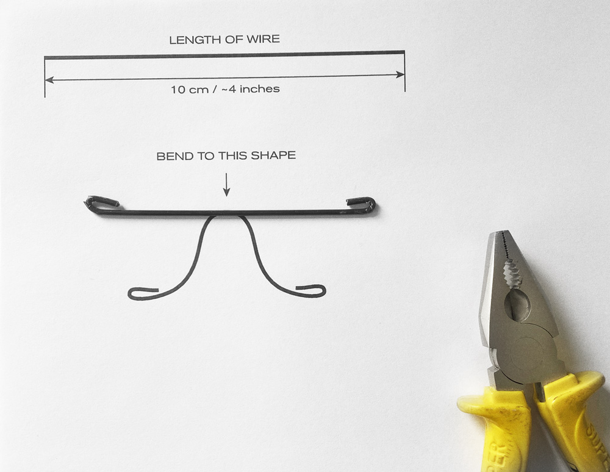
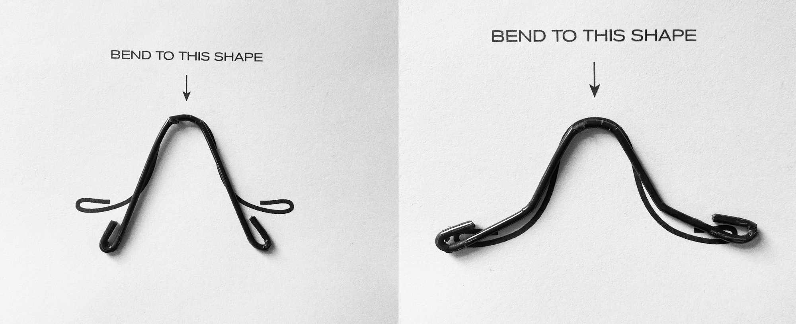
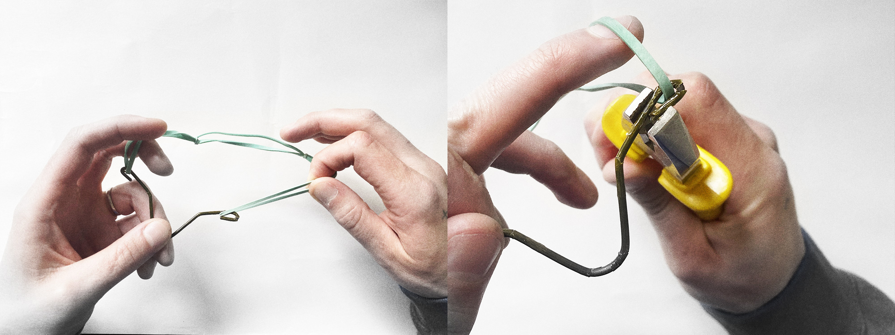
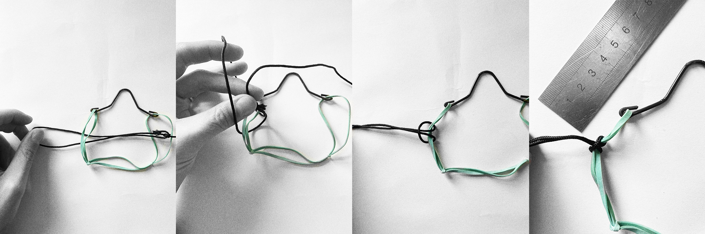
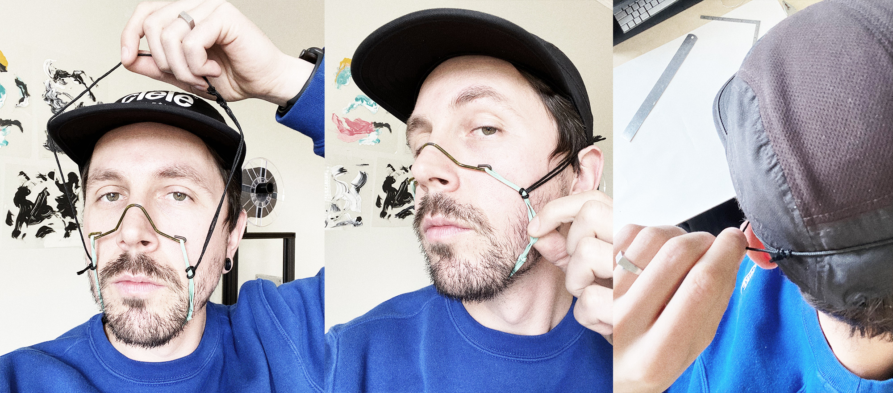

### A mask made from as little as possible, for as many people as possible

It's 2020, a global pandemic of COVID-19 is under way. This virus can spread through airborne droplets expelled by anyone infected. 
Governments around the world have recommended wearing facemasks in an attempt to catch airborne viruses before they reach a persons airways.

The problem is if handled incorrectly, facemasks can actually increase your chances of infection. As you wear one, particles are drawn by your breath towards your mouth getting caught by the mask. Then you handle the mask, say by popping it down to eat and then put it back on and all those particles are then on your fingers or smeared on your face.
The recommendation is to treat it like a worn piece of underwear once you’re home, remove and wash right away and if you only have one then it’s out of play until washed.

We also have a global mask shortage.

Enter __EVERYMASK__ - a DIY mask consisting of a 'face frame' that can tightly fit a rectangle of filter material to a person's face. This mask can be worn in public and at the end of the day, the filter material disposed of or washed and replaced with another.

Some filter materials are better than others, and articles such as <a href="https://www.nytimes.com/article/coronavirus-homemade-mask-material-DIY-face-mask-ppe.html" target="_blank">this one by the New York Times</a> address that in more detail. 
Personally I've read that two layers of 100% cotton such as from a t-shirt or pillowcase is a good place to start.

By focusing on the face frame I hope that a community of __EVERYMASK__ users can improvise on the filter's material and pattern and prevent more infections.

## Instructions

### Materials
There are two possible versions of the face frame.

- 1 uses a 3D printed nose piece, file available on <a href="https://www.thingiverse.com/thing:4266151" target="_blank">Thingiverse</a>. If you have access to a 3D printer go ahead and print this.
- 2 uses a nose piece formed from a piece of stiff wire. Grab yourself a wire clothes hanger, a short nosed pliars and the printable template <a href="https://drive.google.com/file/d/17aeMhx-E7hsK5P1fRn87Dsu_-CW0uVBk/view?usp=sharing" target="_blank">available here</a>.

To complete both versions you will also need:
- A few rubber bands
- 80 cm (~32 inches) of string - ideally thin, nylon cord like kite string or sash cord.

### Build

#### 1. Nose Piece (Wire)

__1.1__ Using <a href="https://drive.google.com/file/d/17aeMhx-E7hsK5P1fRn87Dsu_-CW0uVBk/view?usp=sharing" target="_blank">the template</a> as a guide, snip an 80 cm (~4 inch) piece of stiff wire from the hanger.

__1.2__ Starting from the ends, use a short nose pliars to bend the hooks that will hold the elastic. Leave a gap so that we can slide the elastic into the hook (see step 2.2) later on.

__1.3__ Finish the nose piece by forming the curve that will fit over the bridge of your nose. This is the trickiest part of the process, don't worry if it's not perfect.

#### 2. Elastic
__2.1__ Chain enough rubber bands together to make around a 22-26 cm (9-9.8 inches) length. This part controls the fit to the face, you want that to be tight enough that it creates a good seal, but loose enough to be comfortable. You may need to jump back to this step after testing the fit. 

If you're not sure how to chain rubber bands see <a href="http://littletinkerer.blogspot.com/2014/10/make-your-own-rubber-band-car.html" target="_blank">step 4 here</a>.

__2.2__ Slip both ends of the rubber band chain into the nose piece hooks and squeeze the hooks shut using the pliars.

__2.3__ That's step 2 finished! You can try it on and it might hook on the bridge of your nose - don't worry if it doesn't fit great at this point, it probably won't. Next we're going to add the headstrap which will pull the band towards your cheekbones and create a 'seal' strong enough to tightly hold out filter fabric.

#### 3. Headstrap

__3.1__ Cut about 80 cm (~32 inches) of string/cord and tie a <a href="https://www.animatedknots.com/midshipmans-hitch-knot" target="_blank">Midshipman's Hitch Knot</a> in one end. This knot allows us to create a sliding, adjustable loop that holds when under tension - useful and easy to learn!

__3.2__ In the same way you chained the rubber bands together, fasten the loop to the rubber bands around 2.5 cm (1 inch) from the nose piece hook.

__3.3__ Tie two regular overhand knots one after the other to connect the other end to the rubber band to complete the Face Frame. Will replace this method with a better knot ASAP!

__3.4__ Your Face Frame is complete! Put the nose piece on, pull the rubber band down under your chin and lift the headstrap over your head to secure on the back. With the headstrap running over the top of your ears hold the knot and slide it along the cord that runs through it to tighten.

If the rubber feels too tight try relaxing the strap or adding an extra band. The Face Frame clamps the filter material to the face so the aim is to get the band and nose piece fitting as closely to you facial contours as you can without being too tight and uncomfortable.

#### 4. Filter

__4.1__ The filter is still in development, but in the examples I've shown I have used a 23 cm x 20 cm (9 in x 8 in) corner of a 100% cotton pillowcase giving me 2 layers. 

I clamp it by starting with the top edge. I hold it infront of my face to find the rough center, pinch that and push it under the nose piece, then I work my way out from there. Images coming soon.

## Please Share Your Builds

If you do create an __EVERYMASK__ please share it on social media with hashtag __#EVERYMASK__ so we can come together with ideas on how to improve it.

Reach out with any questions, comments or improvements in the comments section below. I am offering this for free but if you'd like to help support me personally during this time tips are graciously accepted via <a href="https://paypal.me/roowilliams12" target="_blank">PayPal</a>.
## This page is a work in progress.
#### It is being updated daily so please bookmark it and periodically check for complete build instructions and improvements.
